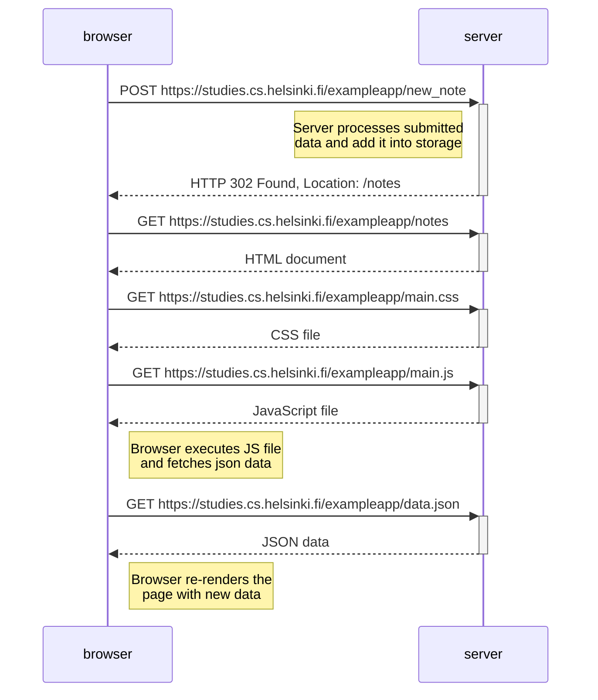

```mermaid
sequenceDiagram
  participant browser
  participant server
  
  browser->>+server: POST https://studies.cs.helsinki.fi/exampleapp/new_note
  Note left of server: Server processes submitted <br>data and add it into storage
  server-->>-browser: HTTP 302 Found, Location: /notes
  browser->>+server: GET https://studies.cs.helsinki.fi/exampleapp/notes
  server-->>-browser: HTML document
  browser->>+server: GET https://studies.cs.helsinki.fi/exampleapp/main.css
  server-->>-browser: CSS file
  browser->>+server: GET https://studies.cs.helsinki.fi/exampleapp/main.js
  server-->>-browser: JavaScript file
  Note right of browser: Browser executes JS file <br>and fetches json data
  browser->>+server: GET https://studies.cs.helsinki.fi/exampleapp/data.json
  server-->>-browser: JSON data
  Note right of browser: Browser re-renders the <br>page with new data
```